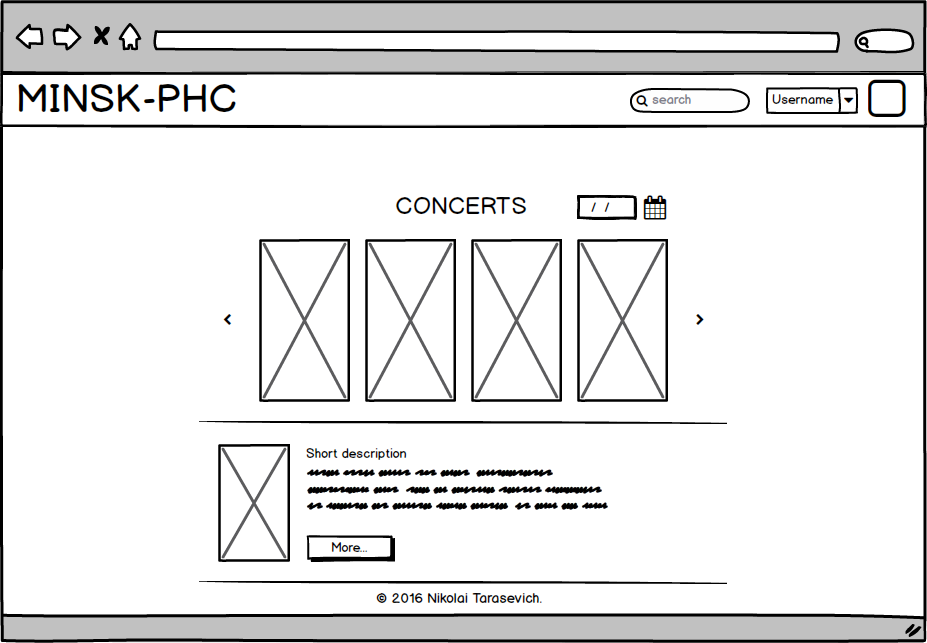
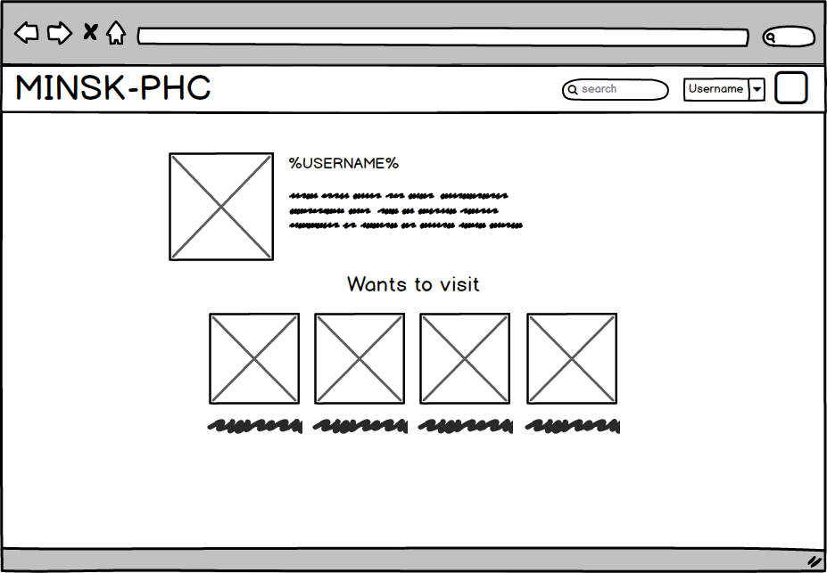
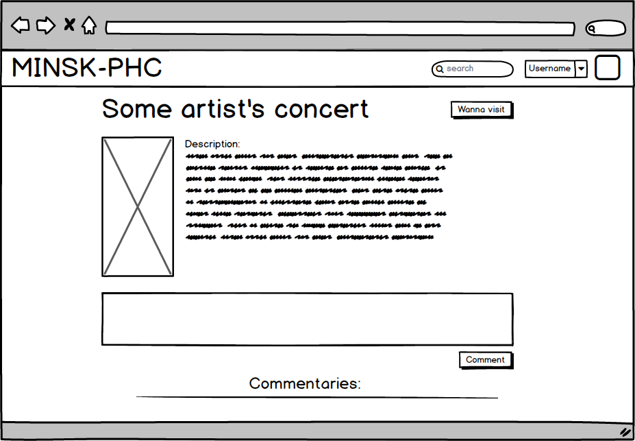

# Introduction
**minsk-phc** is a web-poster of all heavy-music concert events in Minsk. It will store the events, sort by artist, date and user-rating. All the users will have the possibility to comment events and mark them as favorite and hoped-for visiting.
# User Requirements
## Software Interfaces
* Ruby on Rails
* Bootstrap
* jQuery
* HTML5 & CSS3
## User Interfaces
* Start page.

* User profile.

* Event page.

## User Characteristics
There are 3 types of users:
1. Administrators
  * Admins can add events, change event's info and ban users. Also they have all the permissions of General users.
2. General users
  * General users can comment the event and mark them as hoped-for visiting and favorite.
3. Guests
  * Guests can only watch all event's pages.
## Assumptions and Dependencies
There are no any existing APIs to track events. Events have to be added by administrators.
# System Requirements
## Functional Requirements
* Social network authentication.
* Search for events.
* Commentaries.
* Marking the event as favorite and hoped-for visiting for each authorized user.
## Non-Functional Requirements
* Adaptive design - users should have a possibility to track their favorite events using smartphone.
* Simple authentication - there is the possibility to log in on site using social networks, and if you have and account in any popular network such as VKontakte, Twitter and Facebook, you can easily create a profile.
* Web-poster, not a shop - users only have the ability to watch the nearest event's dates, all the other info will be on the organizer's web-site.